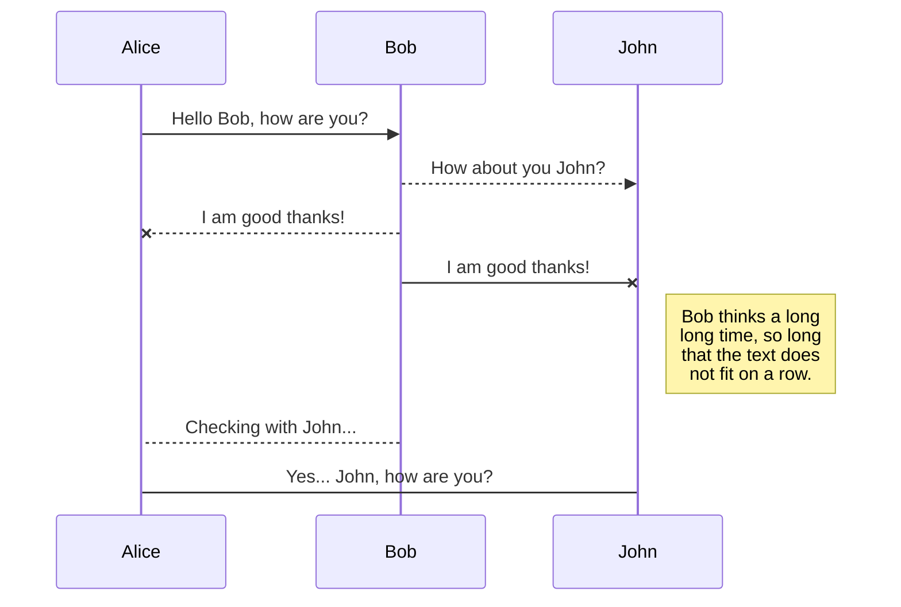
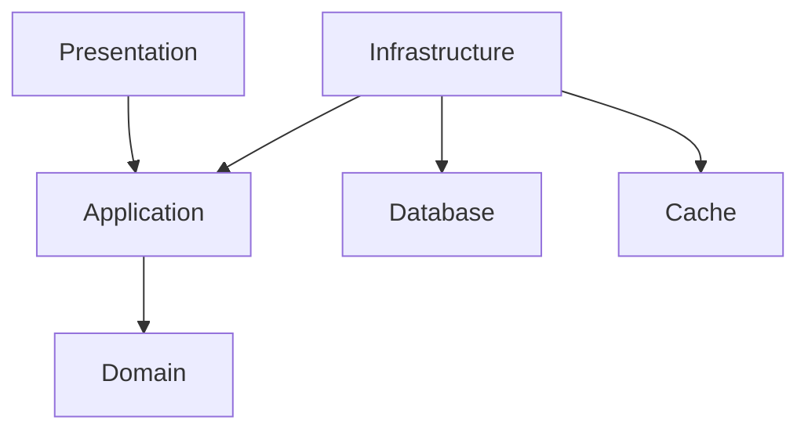

# Welcome to the Todo List 

## Solution Overview 

## Repository Structure

Folders in our repository has been structure in the following way:

|Folder| Decription |
|--|--|
| **mocks** | Mockoon json files representing the mocks used by the front and back end. |
| **specs** | Open API spesification used for generating the controller and clients. |
| **src** | Source code for the front and beack end.  |

## API Spesification

We use a contract first approach when designing and developing the Todo List API. This is  done in collaboration with other members of the team to ensure we have:

- A documented representation of what we will be building. 
- Allow for early validation that helps identify design issues.
- Contain the endpoints, methods, request and response formats as well as the expected error codes.
- Ensure that we reduce inconsistencies between what we have documented and what we are implementing.
- Engineers in the same or diffirent teams can work in parallel once the contract is defined.
- The front end and quality assurance engineers can start development against mock servers.
- Provides a degree of safety when refactoring knowing that internal changes do not affect the API interface.
- Improves visibility and the oppertunity to identify breaking changes as part of the Pull Request process.
- Generate code for controllers and clients 

## Front End 

## Back End

### Application Architecture

We prefer the use of Clean Architecture for our ASP.NET Web API which organises our application into four main layers:

- Presentation - The API is the entry point for communication with the application.
- Application - Business logic spesific to the use cases in our application.
- Domain - Entities, value object and aggregates as well as domain spesific services.
- Infrastructure - Implementation details and integration such as respositories, database context and external service.

Benefits 

- Seperation of concerns with each layer having distinct responsibilities making the code base easier to understand and maintain.
- Flexibility that allows us to make updates to the technology stack without affecting or retesting the core business logic.
- Improves testability as business logic can be tested independantly from the UI and Infrastructure.

Visual Representation

## API Integration Tests

## User Interface Tests

# Getting started

## Cloning the repository

You can clone the repository from https://github.com/DanielNieuwoudt/developer-assessment.git

## Prerequisites

In order to build and run the solution locally, we will need the following prerequisites installed:

| Prerequisites | Description |
|--|--|
| [Docker Desktop](https://www.docker.com/products/docker-desktop/) | Integrated application for building, running, and managing containers. |

## Frameworks, Runtimes and SDKs

| Prerequisites | Description |
|--|--|
| [.NET 8.0 SDK](https://dotnet.microsoft.com/en-us/download/dotnet/8.0) | .NET is the free, open-source, cross-platform framework. |
| [NodeJs](https://nodejs.org/en) | Node.js is a free, open-source, cross-platform JavaScript runtime environment. |

### Tools

For the best local developement and quality assurance experience we recommended the following tools:

| Tool | Description |
|--|--|
| [Mockoon](https://mockoon.com/) | Mockoon is the easiest and quickest way to design and run mock REST APIs. |
| [Node Version Manager](https://github.com/nvm-sh/nvm) | Install, manage, and switch between multiple versions of Node.js on your system. |
| [Redis Insights](https://redis.io/insight/) | Redis Insight lets you visually interact with a Redis Cache. |
| [SSMS](https://redis.io/insight/) | SQL Server Management Studio (SSMS) is an integrated environment for managing any SQL infrastructure. |

### Dependencies

The following dependencies are used in the form of containers to support the development exprience and solution:

| Tool | Description |
|--|--|
| [MIcrosoft SQL Server](https://hub.docker.com/r/microsoft/mssql-server) | Official Microsoft SQL Server container image on Linux for Docker Engine. |
| [Redis](https://hub.docker.com/_/redis/) | Redis is data platform used for caching. |

### Port Mappings

Port mappings allow us to access the running containers, and for the runnning conatiners to access dependencies using our local development machines as a host.

| Container       | Host Port | Container Port |
|-----------------|-----------|----------------|
| Back End        | 5000      | 5000           |
| Front End       | 3000      | 3000           |
| Redis           | 6379      | 6379           |
| SQL Server      | 11433     | 1433           |
| Mockoon         | 4000      | 3000           |

## Building the containers

To build or rebuild all the containers, you can use:

 `docker compose build`

To force a rebuild of all containers without using cache:

`docker compose build --no-cache`

## Running all the dependencies for developement

`docker compose -f .\docker-compose-deps.yaml up --build --detach --remove-orphans`

## Running all the applications and their dependencies as a solution

`docker compose up --build --remove-orphans --detach`

## Accessing the applications

To access the Todo List applications we use the following links:

| Application | Url |
|--|--|
| Front End | http://localhost:3000 |
| Back End | http://localhost:5000/swagger |

> If you are getting redirected for HTTPS you can clear your local HSTS cache by following the instructions below:

In your browser of choice, type the following URL in the address bar:

- chrome://net-internals/#hsts
- edge://net-internals/#hsts

Once there, go to:

-   Delete domain security policies
-   Enter in  `localhost` 
-   Press the  **Delete**  button

## See which containers are running after a docker compose

`docker compose ps`

## Stopping all the containers

`docker compose down`

### Parameters

The following parameters are used when using `docker compose`

| Parameter | Description |
|--|--|
| build | (Recommended) Builds the containers to ensure they are up to date. |
| remove-orphans | (Optional) Clean up services that are no longer defined in the compose YAML. |
| detach | (Optional) Allows you to continue using the terminal for other tasks. |

## Goals

### Local Developer Experience

#### Generating the C# Controller

After updating the Open API spesification we will need to generate the controller code. 

- Using a bash terminal navigate to the /specs/back-end from the root of the closed repository.

- Execute the following bash script to regenerate the C# controller

    `./generate-controller.sh`

#### EF Core Migrations

From `/src/back-end` directory:

- Update to Latest DB After Pull
    
    `dotnet ef database update --project TodoList.Infrastructure --startup-project TodoList.Api --context TodoList.Infrastructure.Data.TodoListDbContext`

- List Migrations
    
    `dotnet ef migrations list --project TodoList.Infrastructure --startup-project TodoList.Api --context TodoList.Infrastructure.Data.TodoListDbContext`

- Create New Migration

    `dotnet ef migrations add <MIGRATIONNAME> --project TodoList.Infrastructure --startup-project TodoList.Api --context TodoList.Infrastructure.Data.TodoListDbContext`

- Remove Last Migration (it if has been applied, need to roll back first -> see update)

    `dotnet ef migrations remove --project TodoList.Infrastructure --startup-project TodoList.Api --context TodoList.Infrastructure.Data.TodoListDbContext`

### Quality Assursance Experience

### Suitability for CI/CD

