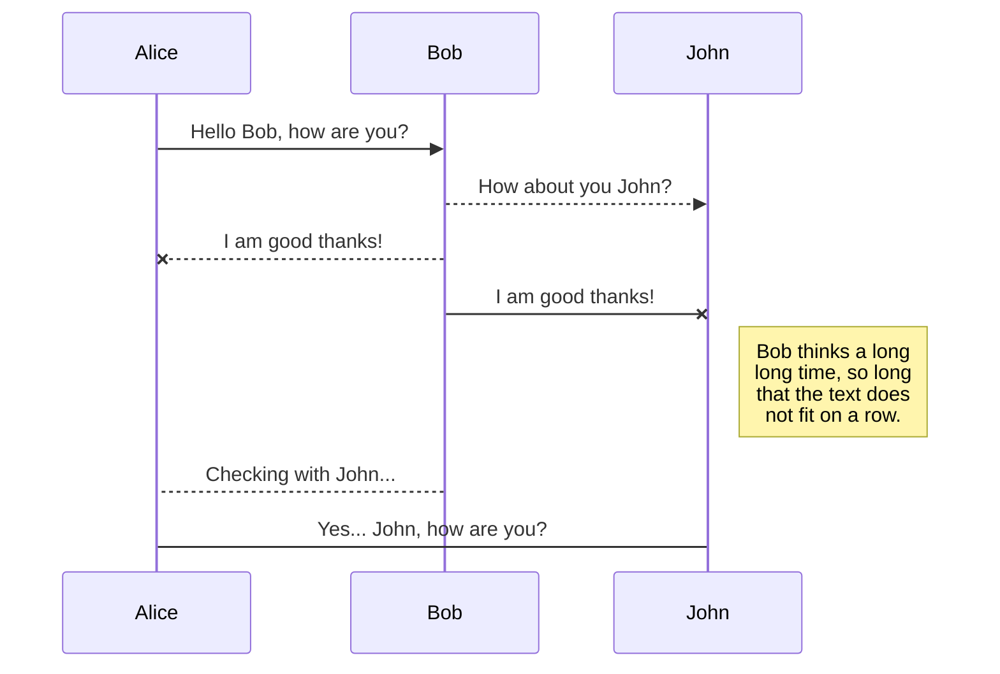
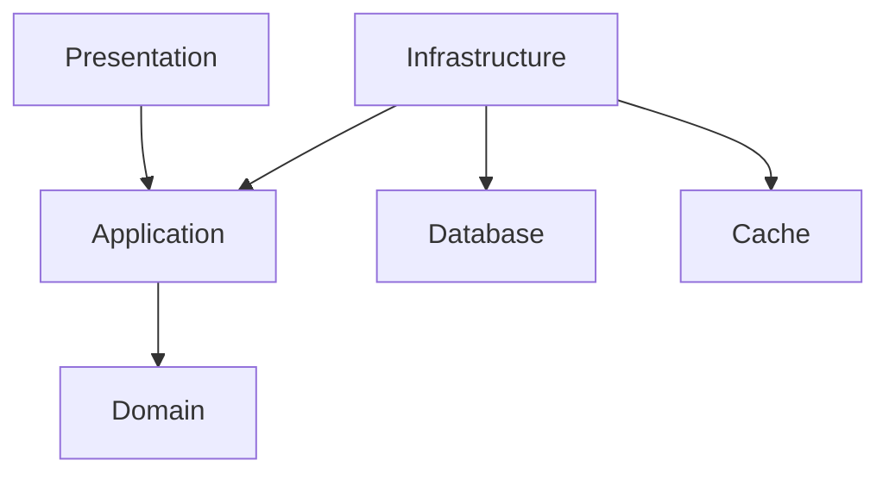

# Welcome to the Todo List 

## Solution Overview 

## Repository Structure

Folders in our repository has been structure in the following way:

|Folder| Decription |
|--|--|
| **mocks** | Mockoon json files representing the mocks used by the front and back end. |
| **specs** | Open API spesification used for generating the controller and clients. |
| **src** | Source code for the front and beack end.  |

## API Spesification

We use a contract first approach when designing and developing the Todo List API. This is  done in collaboration with other members of the team to ensure we have:

- A documented representation of what we will be building. 
- Allow for early validation that helps identify design issues.
- Contain the endpoints, methods, request and response formats as well as the expected error codes.
- Ensure that we reduce inconsistencies between what we have documented and what we are implementing.
- Engineers in the same or diffirent teams can work in parallel once the contract is defined.
- The front end and quality assurance engineers can start development against mock servers.
- Provides a degree of safety when refactoring knowing that internal changes do not affect the API interface.
- Improves visibility and the oppertunity to identify breaking changes as part of the Pull Request process.
- Generate code for controllers and clients 

## Front End 

## Back End

### Application Architecture

We prefer the use of Clean Architecture for our ASP.NET Web API which organises our application into four main layers:

- Presentation - The API is the entry point for communication with the application.
- Application - Business logic spesific to the use cases in our application.
- Domain - Entities, value object and aggregates as well as domain spesific services.
- Infrastructure - Implementation details and integration such as respositories, database context and external service.

Benefits 

- Seperation of concerns with each layer having distinct responsibilities making the code base easier to understand and maintain.
- Flexibility that allows us to make updates to the technology stack without affecting or retesting the core business logic.
- Improves testability as business logic can be tested independantly from the UI and Infrastructure.

Visual Representation

## API Integration Tests

## User Interface Tests

# Getting started

## Cloning the repository

You can clone the repository from https://github.com/DanielNieuwoudt/developer-assessment.git

## Building the containers

To build or rebuild the containers, you can use:

 `docker compose build`

To force a rebuild of the container without using cache:

`docker compose build --no-cache`

## Running the application

To run the containers use:

`docker compose up --build --remove-orphans --detach`

| Parameter | Description |
|--|--|
| build | (Recommended) Builds the containers to ensure they are up to date. |
| remove-orphans | (Optional) Clean up services that are no longer defined in the compose YAML. |
| detach | (Optional) Allows you to continue using the terminal for other tasks. |

## Goals

### Local Developer Experience

### Quality Assursance Experience

### Suitability for CI/CD

## Prerequisites

The following tools are recommended for the best local developement and quality assurance experience.

### Dependencies

### Tools

| Tool | Description |
|--|--|
| [Docker Desktop](https://www.docker.com/products/docker-desktop/) | Integrated application for building, running, and managing containers. |
| [Mockoon](https://mockoon.com/) | Mockoon is the easiest and quickest way to design and run mock REST APIs. |
| [Node Version Manager](https://github.com/nvm-sh/nvm) | Install, manage, and switch between multiple versions of Node.js on your system. |
