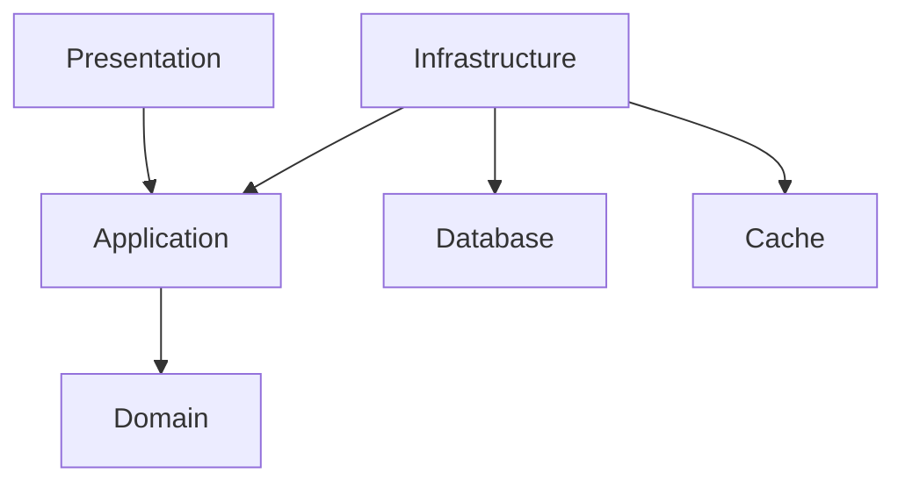

# Welcome to the Todo List 

## Goal

This implementation provides an overview of the engineering practices, principles, tools, and utilities employed by software and quality assurance engineers. 

Many of these elements are crucial for designing, developing, and testing applications that are maintainable, scalable, secure and ready for production.

Our goal is to create a collaborative platform that empowers team members to perform at their best!

## Engineering practices and principles

### Agile

- **Frameworks** - Scrum, Kanban, Lean.
- **Principles** - Iterative development, flexibility, customer collaboration, and response to change.

### Application Architecture and Design Patterns 
- **Purpose** - Provide proven solutions to common design problems.

### Automated Testing
- **Types** - Unit tests, contract tests, end-to-end tests.
- **Benefits** - Detects bugs early, ensures new changes do not break existing functionality, and improves code reliability.

### Code Refactoring
- **Purpose** -  Improve code structure and readability without changing functionality.
- **Benefits** - Reduces technical debt, enhances maintainability, and improves performance.

### Code Reviews
- **Purpose** - Improve code quality, ensure adherence to coding standards, and facilitate knowledge sharing.

- **Process** - Peer review of code changes before they are merged into the main codebase

### Continuous Integration and Continuous Deployment (CI/CD)
- **CI** - Automatically integrating and testing code changes frequently.

- **CD** - Automatically deploying code changes to dev, test, staging and production environments.

> Although we do not automatically deploy our code as part of this assessment, a local development environment that resembles other environments has been provided.

### Documentation
- **Types** - Code comments, API documentation, user manuals, architecture diagrams.
- **Benefits** - Facilitates understanding, maintenance, and onboarding of new developers.

### Version Control
- **Purpose** - Enables tracking changes, collaborating with team members, and managing different code versions.

## Back End

#### Application Architecture

We prefer the use of Clean Architecture for our ASP.NET Web API, which organises our application into four main layers:

- Presentation - The API is the entry point for communication with the application.
- Application - Business logic specific to the use cases in our application.
- Domain - Entities, value objects and aggregates, and domain-specific services.
- Infrastructure - Implementation details and integration include repositories, database context and external service.

Benefits 

- Separation of concerns, with each layer having distinct responsibilities, making the code base easier to understand and maintain.
- Flexibility that allows us to make updates to the technology stack without affecting or retesting the core business logic.
- Improves testability as business logic can be tested independently from the UI and Infrastructure.

Visual Representation

#### Contract first development

We use a contract-first approach when designing and developing the Todo List API. 

In collaboration with other members of the team, we ensure:

- A documented representation of what we will be building. 
- Allow for early validation that helps identify design issues.
- Contain the endpoints, methods, request and response formats, and expected error codes.
- Ensure we reduce inconsistencies between what we have documented and what we are implementing.
- Engineers in the same or different teams can work in parallel once the contract is defined.
- The front-end and quality assurance engineers can start development against mock servers.
- It provides safety when refactoring, knowing that internal changes do not affect the API interface.
- Improves visibility and the opportunity to identify breaking changes as part of the Pull Request process.
- Generate code for controllers and clients 

#### Contract Tests

### Front End 

#### Application Architecture

#### End-to-End Tests

# Getting started

## Prerequisites

To build and run the solution locally, we will need the following prerequisites installed:

| Prerequisites | Description |
|--|--|
| [Docker Desktop](https://www.docker.com/products/docker-desktop/) | Integrated application for building, running, and managing containers. |

## Dependencies

The following dependencies are used in the _form of containers_ to support the development experience and solution:

> There is _no need_ to install these dependencies.

| Tool | Description |
|--|--|
| [Microsoft SQL Server](https://hub.docker.com/r/microsoft/mssql-server) | Official Microsoft SQL Server container image on Linux for Docker Engine. |
| [OIDC Mock Server](https://github.com/Soluto/oidc-server-mock) | A project that allows you to run a configurable mock server with OpenId Connect functionality. |
| [Redis](https://hub.docker.com/_/redis/) | Redis is a data platform used for caching. |

## Frameworks, Runtimes and SDKs

> To make changes to the solution, the following frameworks, runtimes, and SDKs must be installed.

| Prerequisites | Description |
|--|--|
| [.NET 8.0 SDK](https://dotnet.microsoft.com/en-us/download/dotnet/8.0) | .NET is a free, open-source, cross-platform framework. |
| [NodeJs](https://nodejs.org/en) | Node.js is a free, open-source, cross-platform JavaScript runtime environment. |

## Integrated Development Environments

You are free to use an IDE of your choosing. Common IDEs that work with the solution are:

| IDE | Description |
|--|--|
| [Jetbrain Rider](https://www.jetbrains.com/rider/) | The world's most loved .NET and game dev IDE. |
| [Visual Studio](https://visualstudio.microsoft.com/) | The Visual Studio IDE is a creative launching pad that you can use to edit, debug, and build code and then publish an app. |
| [Visual Studio Code](https://code.visualstudio.com/) | Visual Studio Code is a free source code editor that runs on your desktop and supports various languages and runtimes. |

### Tools

For the best local development and quality assurance experience, we recommended the following tools:

| Tool | Description |
|--|--|
| [Mockoon](https://mockoon.com/) | Mockoon is the easiest and quickest way to design and run mock REST APIs. |
| [Node Version Manager](https://github.com/nvm-sh/nvm) | Install, manage, and switch between multiple versions of Node.js on your system. |
| [Redis Insights](https://redis.io/insight/) | Redis Insight lets you visually interact with a Redis Cache. |
| [SSMS](https://redis.io/insight/) | SQL Server Management Studio (SSMS) is an integrated environment for managing any SQL infrastructure. |

## Cloning the repository

You can clone the repository from https://github.com/DanielNieuwoudt/developer-assessment.git

## Repository Structure

Folders in our repository have been structured in the following way:

|Folder| Decription |
|--|--|
| **mocks** | Mockoon JSON files representing the mocks used by the front. |
| **specs** | Open API specification is used to generate the controller and clients. |
| **src** | Source code for the front and back end.  |
| **tests** | Contract and end-to-end automated tests.  |

### Docker compose files

| File | Description |
|--|--|
| docker-compose-auth.yaml | The separated definition and configuration for the mock authentication server.  |
| docker-compose-deps.yaml | The separated definition and configuration of development and solution dependencies. |
| docker-compose.yaml | The full compose includes the authentication server, dependencies, and applications. |

### Port Mappings

Port mappings allow us to access the running containers and for the running containers to access dependencies using our local development machines as hosts.

> We try to let the port selection match the original dependency port.

| Container       | Host Port | Container Port |
|-----------------|-----------|----------------|
| Auth Server     | 5010      | 8080           |
| Back End        | 5000      | 5000           |
| Front End       | 3000      | 3000           |
| Redis           | 6379      | 6379           |
| SQL Server      | 1433      | 1433           |
| Mockoon         | 4000      | 3000           |

> We recommend stopping your local Microsoft SQL Server installation to avoid port conflicts. You can do this by executing the following command from a command prompt with elevated privileges:

`NET STOP mssqlserver`

## Building the containers

To build or rebuild all the containers, you can use:

 `docker compose build`

To force a rebuild of all containers without using cache:

`docker compose build --no-cache`

## Running all the dependencies for development

`docker compose -f .\docker-compose-deps.yaml up --build --detach --remove-orphans`

## Running all the applications and their dependencies as a solution

`docker compose up --build --remove-orphans --detach`

## Accessing the applications

To access the Todo List applications, we use the following links:

| Application | Url |
|--|--|
| Front End | http://localhost:3000 |
| Back End | http://localhost:5000/swagger |

> If you are getting redirected for HTTPS you can clear your local HSTS cache by following the instructions below:

In your browser of choice, type the following URL in the address bar:

- chrome://net-internals/#hsts
- edge://net-internals/#hsts

Once there, go to:

- Delete domain security policies
- Enter in  `localhost` 
- Press the  **Delete** button

## See which containers are running after a docker compose

`docker compose ps`

## Stopping all the containers

`docker compose down`

### Parameters

The following parameters are used when using `docker compose`

| Parameter | Description |
|--|--|
| build | (Recommended) Build the containers to ensure they are up to date. |
| remove-orphans | (Optional) Clean up services that are no longer defined in the compose YAML. |
| detach | (Optional) Allows you to continue using the terminal for other tasks. |

### For Software Engineers

#### Generating the C# Controller

After updating the Open API specification, we must regenerate the controller code. 

- Navigate to the `/specs/back-end` from the repository's root using a bash terminal.

- Execute the following bash script to regenerate the C# controller

    `./generate-controller.sh`

#### Using EF Core Migrations

From `/src/back-end` directory:

- Update to Latest DB After Pull

    `dotnet ef database update 
        --project TodoList.Infrastructure 
        --startup-project TodoList.Api 
        --context TodoList Infrastructure.Data.TodoListDbContext`

- List Migrations

    `dotnet ef migrations list 
        --project TodoList.Infrastructure 
        --startup-project TodoList.Api 
        --context TodoList.Infrastructure.Data.TodoListDbContext`

- Create New Migration

    `dotnet ef migrations add <MIGRATIONNAME> 
        --project TodoList.Infrastructure 
        --startup-project TodoList.Api 
        --context TodoList.Infrastructure.Data.TodoListDbContext`

- Remove Last Migration (it if has been applied, need to roll back first -> see update)

    `dotnet ef migrations remove 
        --project TodoList.Infrastructure 
        --startup-project TodoList.Api 
        --context TodoList.Infrastructure.Data.TodoListDbContext`

### For Quality Assurance Engineers