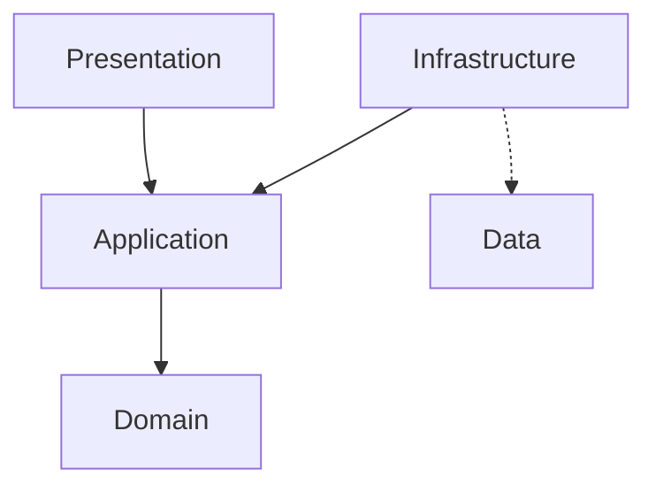

# Welcome to the Todo List 

## Solution Overview 

## Solution Structure

## Front End 

## Back End

### Application Architecture

We prefer the use of Clean Architecture for our ASP.NET Web API which organises our application into four main layers:

- Presentation - The API is the entry point for communication with the application.
- Application - Business logic spesific to the use cases in our application.
- Domain - Entities, value object and aggregates as well as domain spesific services.
- Infrastructure - Implementation details and integration such as respositories, database context and external service.

Benefits 

- Seperation of concerns with each layer having distinct responsibilities making the code base easier to understand and maintain.
- Flexibility that allows us to make updates to the technology stack without affecting or retesting the core business logic.
- Improves testability as business logic can be tested independantly from the UI and Infrastructure.

Visual Representation

## API Integration Tests

## User Interface Tests

# Getting started

## Goals

### Local Developer Experience

### Quality Assursance Experience

### Suitability for CI/CD

## Prerequisites

The following tools are recommended for the best local developement and quality assurance experience.

### Dependencies

### Tools

| Tool | Description |
|--|--|
| [Docker Desktop](https://www.docker.com/products/docker-desktop/) | Integrated application for building, running, and managing containers. |
| [Mockoon](https://mockoon.com/) | Mockoon is the easiest and quickest way to design and run mock REST APIs. |
| [Node Version Manager](https://github.com/nvm-sh/nvm) | Install, manage, and switch between multiple versions of Node.js on your system. |

## Cloning the repository

## Building the containers

To build or rebuild the containers, you can use:

 `docker compose build`

To force a rebuild of the container without using cache:

`docker compose build --no-cache`

## Running the application

To run the containers use:

`docker compose up --build --remove-orphans --detach`

| Parameter | Description |
|--|--|
| build | (Recommended) Builds the containers to ensure they are up to date. |
| remove-orphans | (Optional) Clean up services that are no longer defined in the compose YAML. |
| detach | (Optional) Allows you to continue using the terminal for other tasks. |
